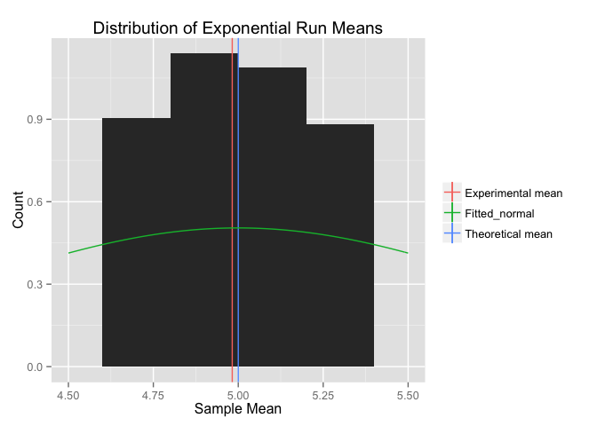

# Applying the Central Limit Theory to Exponential Random Variables
Matthew Gast  
June 2015  

# Overview

In a few (2-3) sentences explain what is going to be reported on.

# Simulations

Include English explanations of the simulations you ran, with the
accompanying R code. Your explanations should make clear what the R
code accomplishes.

First, we define constants for use in this analysis.  This paper
analyzes the exponential distribution, and uses sets of 40 numbers
with a $\\lambda$=0.2.  The exponential distribution's theoretical
mean will be $\\lambda$^-1^, and its variance is $\\lambda$^-2^.  We
also set the confidence interval for testing to be done, and will be
looking for significance at the .05 level.


```r
lambda <- 0.2
size <- 40
sims <- 1000
alpha <- .05
library(ggplot2)
```

The raw data used in this simulation is 1,000 sets of exponential
random data.  Each set has 40 numbers in it, and is stored in a row of
the matrix `rnds`.


```r
rnds <- NULL
for (i in 1:sims) {
    expRun <- rexp(size, lambda)
    rnds <- rbind(rnds, expRun)
}
```

# Means: Sample and Theoretical

The theoretical mean of the exponential distribution is
$\\lambda$^-1^; in this case, the theoretical mean is therefore 5.

First, we calculate a set of sample means.  To calculate the mean
value in each set, call `rowMeans()` to get the mean of each row, and
therefore, of each simulation.  The distribution sample means should
be clustered around the theoretical value.  A t-test shows that
confidence interval for the sample mean does in fact contain the
theoretical value.


```r
theoMean <- 1/lambda
rnd_means <- rowMeans(rnds)
sampleMean <- mean(rnd_means)
meanTest <- t.test(rnd_means,mu=theoMean,alternative="two.sided",conf.level=(1-alpha))
meanTest$conf.int
```

```
## [1] 4.932811 5.031751
## attr(,"conf.level")
## [1] 0.95
```

Mean histogram figure: the red line shows the experimentally
determined mean over our 1,000 runs.  The blue value is the
theoretical value calculated.  See that they are close.


```r
meanHistogram <-  ggplot(as.data.frame(rnd_means),aes(x=rnd_means)) + 
geom_histogram(binwidth=lambda,aes(y=..density..))+
geom_vline(aes(xintercept=1/lambda,color="Theoretical mean"),show_guide=TRUE) +
geom_vline(aes(xintercept=sampleMean,color="Experimental mean"),show_guide=TRUE) + 
stat_function(fun=dnorm,args=list(mean=1/lambda,sd=sqrt(25/40)),aes(color="Fitted_normal")) +
xlab("Sample Mean") +
ylab("Count") +
ggtitle ("Distribution of Exponential Run Means") +
theme(legend.title=element_blank())
meanHistogram
```

 

```r
meanHistogram + xlim(4.5,5.5)
```

 

# Variance: Sample versus Theoretical

First, we calculate the theoretical variance.  It is given by distribution variance (1/lambda^-2^) divided by the size of each sample (40).

The sample variance is calculated straightforwardly.  However, the confidence interval for a variance is modeled by the chi-square distribution.  The chi-square distribution is not symmetric.  Once again, we are testing to the .95 confidence level, so construct the interval.


```r
theoVar <- 1/(size*lambda^2)
sampleVar <- var (rnd_means)
var_low <- sampleVar*(sims-1)/qchisq((1-alpha/2),(sims-1))
var_high <- sampleVar*(sims-1)/qchisq((alpha/2),(sims-1))
c(var_low,var_high)
```

```
## [1] 0.5832803 0.6951630
```

```r
theoVar
```

```
## [1] 0.625
```

The sample variance confidence interval includes the theoretical variance.

# Distribution

Via figures and text, explain how one can tell the distribution is
approximately normal.

The QQ plot is linear.


```r
qq_data <- as.data.frame(rnd_means)
ggplot(qq_data,aes(sample=rnd_means)) + stat_qq()
```

 

The QQ plot for the same number of random numbers (40,000), but it
shows a distinct skew away from normality.


```r
exp_nums <- rexp(size*sims,lambda)
exp_qq <- as.data.frame(exp_nums)
ggplot(exp_qq,aes(sample=exp_nums)) + stat_qq()
```

 


