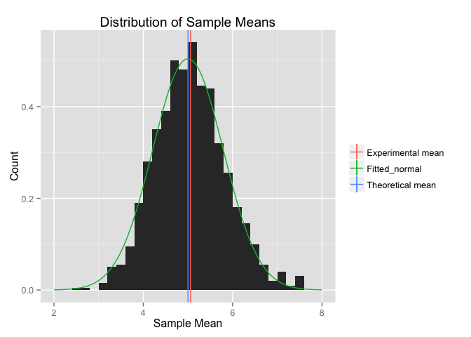

# Applying the Central Limit Theorem to Exponential Random Variables
Matthew Gast  
June 2015  

# Overview

This paper uses a simulation to explore the Central Limit Theorem
(CLT).  A large collection of means of random variables will be
normally distributed, even though the random variables themselves may
have another distribution.  The simulation in this paper shows that a
large number of sample means is in fact normally distributed.

# Simulations

This analysis will use 1,000 samples of the exponential distribution,
each consisting of 40 numbers.  To enable readers of the paper, these
size variables are defined as the variables `samples` and `size`,
respectively.  The exponential distribution also takes one parameter,
$\\lambda$, which this paper sets to 0.2.  Finally, the paper also
sets the confidence level for statistical tests, $\\alpha$=0.05.


```r
library(ggplot2)
library(gridExtra)
```

```
## Loading required package: grid
```

```r
samples <- 1000
size <- 40
lambda <- 0.2
alpha <- .05
```

The exponential distribution's theoretical properties are a mean of
$\\lambda$^-1^=5, and a variance of $\\lambda$^-2^=`r
1/lambda^2`.

Begin by generating the raw data, and store it in the matrix `rnds`.  Each row within `rnds` is a sample of data, and the data is stored across columns.


```r
rnds <- NULL
for (i in 1:samples) {
    expRun <- rexp(size, lambda)
    rnds <- rbind(rnds, expRun)
}
```

# Means: Sample and Theoretical

The theoretical mean of the exponential distribution is
$\\lambda$^-1^; in this case, the theoretical mean is therefore 5.  To
obtain the sample means of the simulated data, we call the
`rowMeans()` function to get a mean value for each sample.

To compare the mean of the 1000 sample means to the theoretical
value, we can calculate the theoretical mean `theoMean` and compare it
to the sample mean with a t.test.  In fact, the t-test shows that the
confidence interval for the sample mean contains the theoretical mean,
indicating that the sample is consistent with the theoretical value.


```r
theoMean <- 1/lambda
rnd_means <- rowMeans(rnds)
sampleMean <- mean(rnd_means)
sampleMean
```

```
## [1] 5.003794
```

```r
meanTest <- t.test(rnd_means,mu=theoMean,alternative="two.sided",conf.level=(1-alpha))
meanTest$conf.int
```

```
## [1] 4.954594 5.052995
## attr(,"conf.level")
## [1] 0.95
```

To look at the distribution of means, consider the following histogram
and excerpt.  On the left side of the figure, a histogram is drawn to
show the distribution of sample means.  A red vertical line shows the
mean value of the sample means, while the blue vertical line shows the
theoretical value.  The two are quite close together, as expected.
Additionally, the normal distribution is superimposed in green.  The
right panel plot zooms in on the theoretical value to show the peak of
the curve.


```r
meanHistogram <- ggplot(as.data.frame(rnd_means),aes(x=rnd_means)) + 
geom_histogram(binwidth=lambda,aes(y=..density..))+
geom_vline(aes(xintercept=1/lambda,color="Theoretical mean"),show_guide=TRUE) +
geom_vline(aes(xintercept=sampleMean,color="Experimental mean"),show_guide=TRUE) + 
stat_function(fun=dnorm,args=list(mean=1/lambda,sd=sqrt(25/40)),aes(color="Fitted_normal")) +
xlab("Sample Mean") +
ylab("Count") +
ggtitle ("Distribution of Exponential Run Means") +
theme(legend.title=element_blank())
zoomedMeanHistogram <- meanHistogram + xlim(0.9*theoMean,1.1*theoMean)
grid.arrange(meanHistogram,zoomedMeanHistogram,ncol=2)
```

 

# Variance: Sample versus Theoretical

Next, consider the variance of sample means.  The theoretical value
for the variance of sample means is given by the distribution variance
divided by the size of the sample.  In the case of the exponential
distribution, the variance is $$\\lambda$^-2^, and the sample size is
40, so the variance will be 1/(size * lambda^2), or `r
1/(size*lambda^2)`.

The variance is distributed according to the the $\chi^2^
distribution, which is asymmetric.  To see if the variance lies within
the confidence interval, we construct the confidence interval in the
same manner as before, but we use the $\chi^2^ distribution.


```r
theoVar <- 1/(size*lambda^2)
sampleVar <- var (rnd_means)
var_low <- sampleVar*(samples-1)/qchisq((1-alpha/2),(samples-1))
var_high <- sampleVar*(samples-1)/qchisq((alpha/2),(samples-1))
c(var_low,var_high)
```

```
## [1] 0.5769482 0.6876164
```

```r
theoVar
```

```
## [1] 0.625
```

The sample variance confidence interval includes the theoretical variance.

# Distribution

The distribution of sample means should be approximately normal.  In
addition to assessing fit visually versus the curve in the plot above,
consider a quantile-quantile (Q-Q) plot.  The Q-Q plot plots the
theoretical quantile of an observation versus its position in the
sample.  The function `gg_qq` draws a Q-Q plot for a set of data and a
given distribution, and overlays a confidence region on the plot^[The
`gg_qq` function was customized from *Foo0*'s post on StackOverflow:
http://stackoverflow.com/questions/4357031/qqnorm-and-qqline-in-ggplot2].
As long as the plotted data is within the confidence region, it
matches the given distribution.


```r
gg_qq <- function(x, distribution = "norm", ... , label.outliers=FALSE, conf = 0.95 ){

  words <- strsplit(distribution, " ")[[1]]
  distName <- paste(toupper(substring(words, 1,1)),
  	            tolower(substring(words, 2)),
                    sep="", collapse=" ")

  q.function <- eval(parse(text = paste0("q", distribution)))
  d.function <- eval(parse(text = paste0("d", distribution)))
  x <- na.omit(x)
  ord <- order(x)
  n <- length(x)
  P <- ppoints(length(x))
  df <- data.frame(ord.x = x[ord], z = q.function(P, ...))

  Q.x <- quantile(df$ord.x, c(0.25, 0.75))
  Q.z <- q.function(c(0.25, 0.75), ...)
  b <- diff(Q.x)/diff(Q.z)
  coef <- c(Q.x[1] - b * Q.z[1], b)

  zz <- qnorm(1 - (1 - conf)/2)
  SE <- (coef[2]/d.function(df$z)) * sqrt(P * (1 - P)/n)
  fit.value <- coef[1] + coef[2] * df$z
  df$upper <- fit.value + zz * SE
  df$lower <- fit.value - zz * SE

  labels<-names(x)
  if(label.outliers==TRUE){ 
    df$label <- ifelse(df$ord.x > df$upper | df$ord.x < df$lower, labels[ord],"")
    }

  p <- ggplot(df, aes(x=z, y=ord.x)) +
    geom_point() + 
    geom_abline(intercept = coef[1], slope = coef[2]) +
    geom_ribbon(aes(ymin = lower, ymax = upper), alpha=0.2) +
    ggtitle(paste(distName,"Q-Q Plot")) +
    xlab(paste("Theoretical",distName,"Quantile")) +
    ylab(paste("Sample",distName,"Quantile")) 
  if(label.outliers==TRUE) p <- p + geom_text( aes(label = label))
   return(p)
}

gg_qq(rnd_means)
```

 

As a contrast to the Q-Q plot showing the normal distribution of
sample means, consider the entire set of random numbers.  If the
overall collection is examined in a normal Q-Q plot, it fails to look
remotely like the normal distribution.  However, when plotted in an
exponential Q-Q plot, it matches the theoretical line quite well.


```r
rnds_vector <- as.vector(rnds)
norm_plot <- gg_qq(rnds_vector)
exp_plot <- gg_qq(rnds_vector,distribution="exp")
grid.arrange(norm_plot,exp_plot,ncol=2)
```

 


