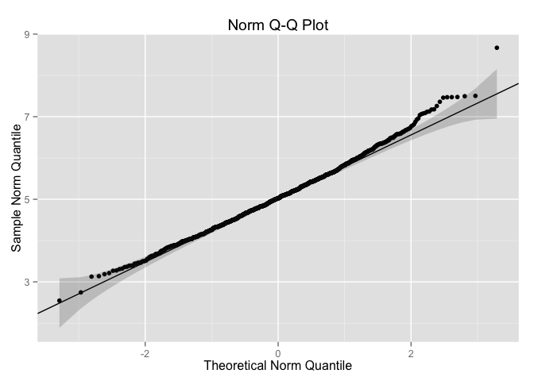

# Central Limit Theorem Simulations
Matthew Gast  
June 2015  

# Overview

This paper uses a simulation to explore the Central Limit Theorem
(CLT).  By dividing a large collection of exponential random variables
into smaller groups and taking the mean of those groups, it is
possible to create a normal distribution, even though the underlying
random values are exponentially distributed.  The simulation in this
paper demonstrates that sample means from an exponential distribution
are normally distributed.

# Simulations

This analysis will use 1,000 samples of the exponential distribution,
each consisting of 40 numbers.  To enable readers of the paper to
customize the simulation, these size variables are defined as the
variables `samples` and `size`, respectively.  The exponential
distribution also takes one parameter, $\lambda$, which this paper
sets to 0.2.  Finally, the paper also sets the confidence level for
statistical tests, $\alpha$=0.05.


```r
samples <- 1000
size <- 40
lambda <- 0.2
alpha <- .05
```

Begin by generating the raw data, and store it in the matrix `rnds`.
Each row within `rnds` is a sample of data, and the data is stored
across columns.


```r
for (i in 1:samples) { expRun <- rexp(size, lambda) ; rnds <- rbind(rnds, expRun) }
```

# Means: Sample and Theoretical

The theoretical mean of the exponential distribution is $1/\lambda$;
in this case, the theoretical mean is therefore 5.  To
obtain the sample means of the simulated data, we call the
`rowMeans()` function to get a mean value for each sample.

To compare the mean of the 1000 sample means to the theoretical
value, we can calculate the theoretical mean `theoMean` and compare it
to the sample mean `sampleMean` with a t test.  In fact, the test
shows that the confidence interval for the sample mean contains the
theoretical mean, indicating that the sample is consistent with the
theoretical value.


```r
theoMean <- 1/lambda
rnd_means <- rowMeans(rnds)
sampleMean <- mean(rnd_means)
sampleMean
```

```
## [1] 5.055576
```

```r
meanTest <- t.test(rnd_means,mu=theoMean,alternative="two.sided",conf.level=(1-alpha))
meanTest$conf.int
```

```
## [1] 5.005895 5.105258
## attr(,"conf.level")
## [1] 0.95
```

To look at the distribution of means, consider the following
histogram.  The histogram is drawn to show the distribution of sample
means.  A red vertical line shows the mean value of the sample means,
while the blue vertical line shows the theoretical value.  The two are
quite close together, as expected.  Additionally, the normal
distribution is superimposed in green.

 

# Variance: Sample versus Theoretical

Next, consider the variance of sample means.  The theoretical value
for the variance of sample means is given by the distribution variance
divided by the size of the sample.  In the case of the exponential
distribution, the variance is $1/\lambda$^2^, and the sample size is
40, so the variance will be $1/(size * \lambda^2)$, or
0.625.

The variance is distributed according to the the $\chi$^2^
distribution, which is asymmetric.  To see if the variance lies within
the confidence interval, we construct the confidence interval in the
same manner as before, but we use the $\chi$^2^ distribution.  As
expected, the theoretical variance is included within the confidence
interval of the sample variance.


```r
theoVar <- 1/(size*lambda^2)
sampleVar <- var (rnd_means)
var_low <- sampleVar*(samples-1)/qchisq((1-alpha/2),(samples-1))
var_high <- sampleVar*(samples-1)/qchisq((alpha/2),(samples-1))
c(var_low,var_high)
```

```
## [1] 0.5882784 0.7011198
```

```r
theoVar
```

```
## [1] 0.625
```

# Distribution

The distribution of sample means should be approximately normal.  In
addition to assessing fit visually versus the curve in the plot above,
consider a quantile-quantile (Q-Q) plot.  The Q-Q plot shows the
theoretical quantile of an observation versus its position in the
sample.  This paper defines the function `gg_qq` to draw Q-Q plots for
various distributions, and additionally overlays a confidence region
on the plot.^[The `gg_qq` function was customized from *Foo0*'s post
on StackOverflow:
http://stackoverflow.com/questions/4357031/qqnorm-and-qqline-in-ggplot2]
If plotted data lies within the confidence region, it matches the
given distribution.

First, look at a Q-Q plot of the sample means for the normal
distribution.  The data are broadly consistent with the hypothesis
that the data are normally distributed.

 

As a contrast to the Q-Q plot showing the normal distribution of the
1000 sample means, consider the entire set of random numbers.
If the overall collection is examined in a normal Q-Q plot as in the
left panel below, it fails to look remotely like the normal
distribution.  However, when plotted in an exponential Q-Q plot on the
right, it matches the theoretical line quite well.  Therefore, we can
demonstrate that although the entire pool of simulated data is clearly
exponentially distributed because it matches the exponental Q-Q plot,
the sample means are normally distributed.

 

