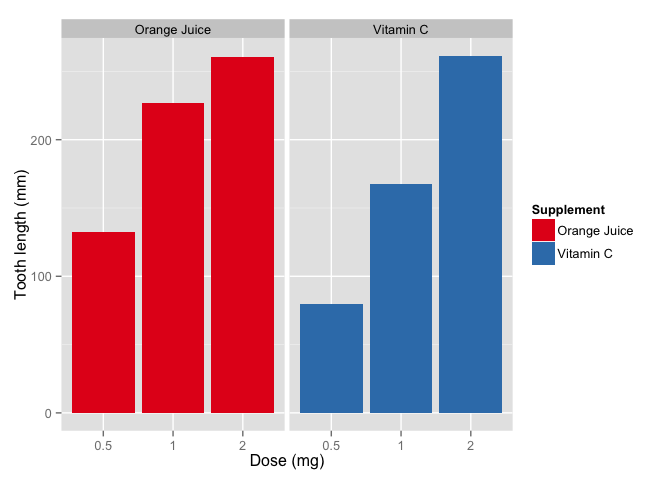
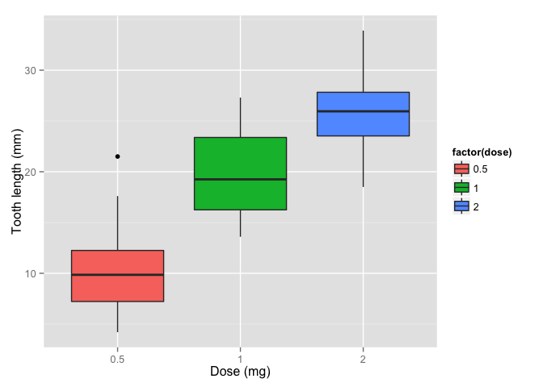

# The Effect of Dietary Supplements on Tooth Growth
Matthew Gast  
June 2015  

# Exploration


After loading the data on tooth growth in guinea pigs, do some basic exploration of the data by looking at the number of observations and the distribution of each of the variables.


```r
dim(ToothGrowth)
```

```
## [1] 60  3
```

```r
summary(ToothGrowth)
```

```
##       len        supp         dose      
##  Min.   : 4.20   OJ:30   Min.   :0.500  
##  1st Qu.:13.07   VC:30   1st Qu.:0.500  
##  Median :19.25           Median :1.000  
##  Mean   :18.81           Mean   :1.167  
##  3rd Qu.:25.27           3rd Qu.:2.000  
##  Max.   :33.90           Max.   :2.000
```

In this analysis, we are interested in whether there is a difference
We have 60 measurements, 30 of each type of supplement.  Within that,
there are 10 of each of three doses of each supplement.  Both treatments seem to increase tooth length, as seen below in the plot of supplement type

 

Additionally, regardless of the supplement type, we can see that increased doses lead to longer teeth.

 

From the exploration of the data, it appears that both supplements
promote tooth growth, and the amount of growth increases with the
dosage.  To make quantitative predictions, we turn to a regression
analysis.

# Regression Models

On a theoretical basis, there are reasons to believe that both the
supplement type and dose will have an effect on the size of teeth.
Therefore, we include both as predictors in our regression analysis,
with the length as the output variable.


```r
tooth.m <- lm (len ~ dose + supp, data=ToothGrowth)
summary(tooth.m)
```

```
## 
## Call:
## lm(formula = len ~ dose + supp, data = ToothGrowth)
## 
## Residuals:
##    Min     1Q Median     3Q    Max 
## -6.600 -3.700  0.373  2.116  8.800 
## 
## Coefficients:
##             Estimate Std. Error t value Pr(>|t|)    
## (Intercept)   9.2725     1.2824   7.231 1.31e-09 ***
## dose          9.7636     0.8768  11.135 6.31e-16 ***
## suppVC       -3.7000     1.0936  -3.383   0.0013 ** 
## ---
## Signif. codes:  0 '***' 0.001 '**' 0.01 '*' 0.05 '.' 0.1 ' ' 1
## 
## Residual standard error: 4.236 on 57 degrees of freedom
## Multiple R-squared:  0.7038,	Adjusted R-squared:  0.6934 
## F-statistic: 67.72 on 2 and 57 DF,  p-value: 8.716e-16
```

The regression model predicts about 70% of the variation in the data.
The intercept value in the model is 9.3, which indicates that the
length of a tooth without supplements will be approximately 9.3 mm.
The coefficient of the `dose` variable should be interpreted as the
predicted increase in tooth length of a 1 mg supplement dose while
holding the supplement type constant.  With a value of 9.8, the
regression model predicts that a 1 mg increase in supplement dosage
will increase the tooth length by 9.8 mm.  Finally, the `suppVC`
variable is a dummy variable that takes on either "Vitamin C" or
"orange juice."  The coefficient is -3.7, which indicates that
delivering the supplement as pure Vitamin C instead of orange juice
decreases the tooth length by 3.7 mm.

The regression model also calculates p-values for each coefficient,
all of which are significant at the .01 level, indicating that each of
the items has explanatory power.  For a different look at the
regression model, consider the confidence intervals calculated for
each of the coefficients in the regression.


```r
confint(tooth.m)
```

```
##                 2.5 %    97.5 %
## (Intercept)  6.704608 11.840392
## dose         8.007741 11.519402
## suppVC      -5.889905 -1.510095
```

When considering the coefficients, the null hypothesis is that the
coefficient is zero, that is, that the predictor has no relation to
the observed change in tooth length.  As expected, given the highly
significant p-values for the coefficients in the model, the 95%
confidence intervals do not contain zero.

Finally, we can perform a power test to estimate the likelihood that
our conclusions are correct.  Once again, the null hypothesis that we
rejected is that each of the coefficients is zero; that is, there is
no effect from either the dose or type of supplement.  A power test
will calculate the probability that our rejection of the null
hypothesis is correct.  In this case, statistical power depends on the
difference between the observed value of the coefficient and its value
under the null hypothesis (zero), the number of observations, and the
desired significance level.  R's `power.t.test` function will
calculate power.  The number of observations is given by the size of
our matrix.  The difference in the null hypothesis and alternative
hypothesis is given by the sample coefficient value.  Finally, we give
the sample standard deviation.  From these, the function calculates
statistical power.


```r
power.t.test(n=nrow(ToothGrowth),delta=summary(tooth.m)$coef[2,1],sd=summary(tooth.m)$coef[2,2],type="two.sample")$power
```

```
## [1] 1
```

```r
power.t.test(n=nrow(ToothGrowth),delta=summary(tooth.m)$coef[3,1],sd=summary(tooth.m)$coef[3,2],type="two.sample")$power
```

```
## [1] 1
```

In this regression, statistical power is high because the difference
of the coefficients is several standard deviations from the
alternative hypothesis in both cases.

# Conclusions

From the analysis of the regression, we conclude that the orange juice is more effective than vitamin C as a supplement in increasing tooth length in guinea pigs, but that the dosage of the supplement has larger effects than the type of supplement.

